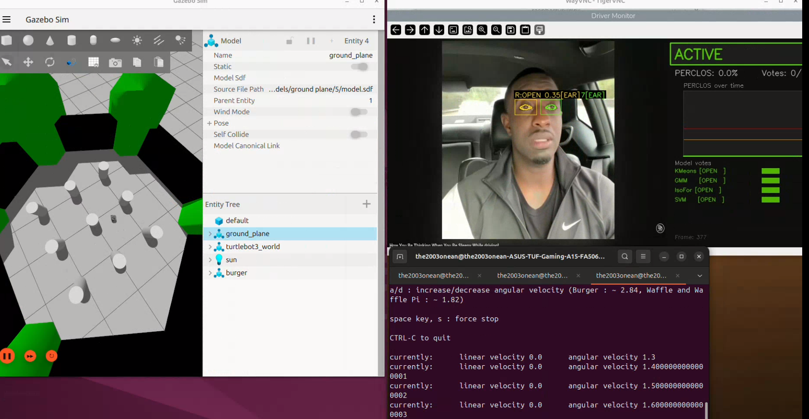
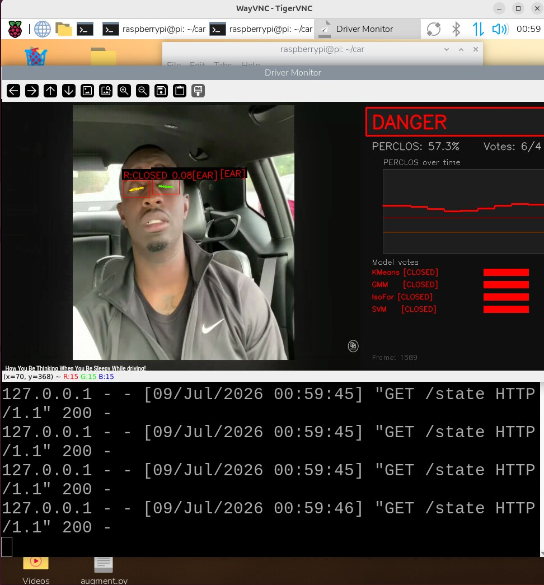
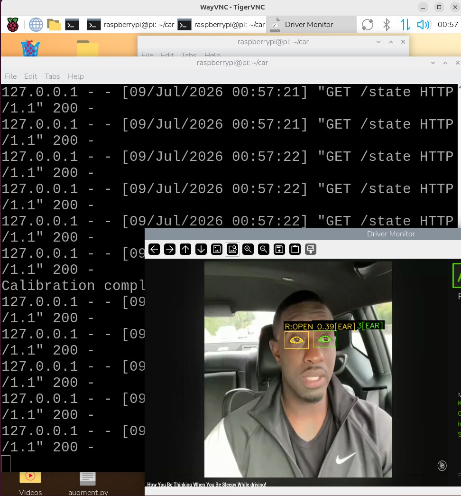
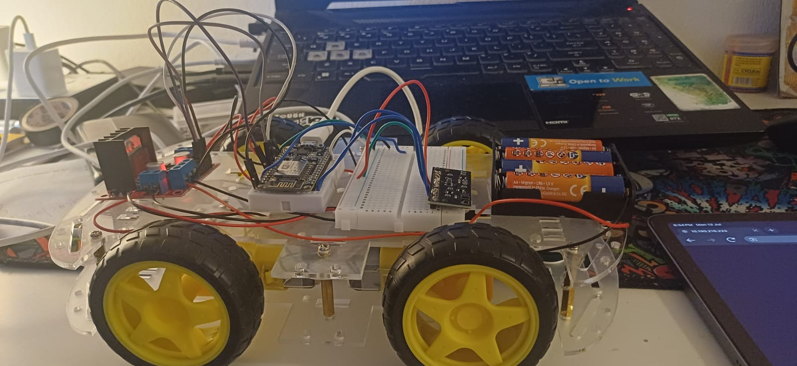
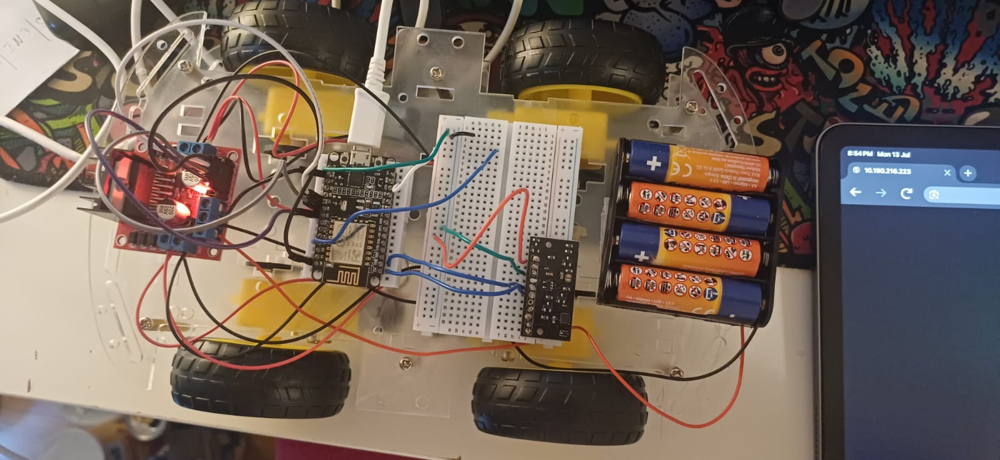
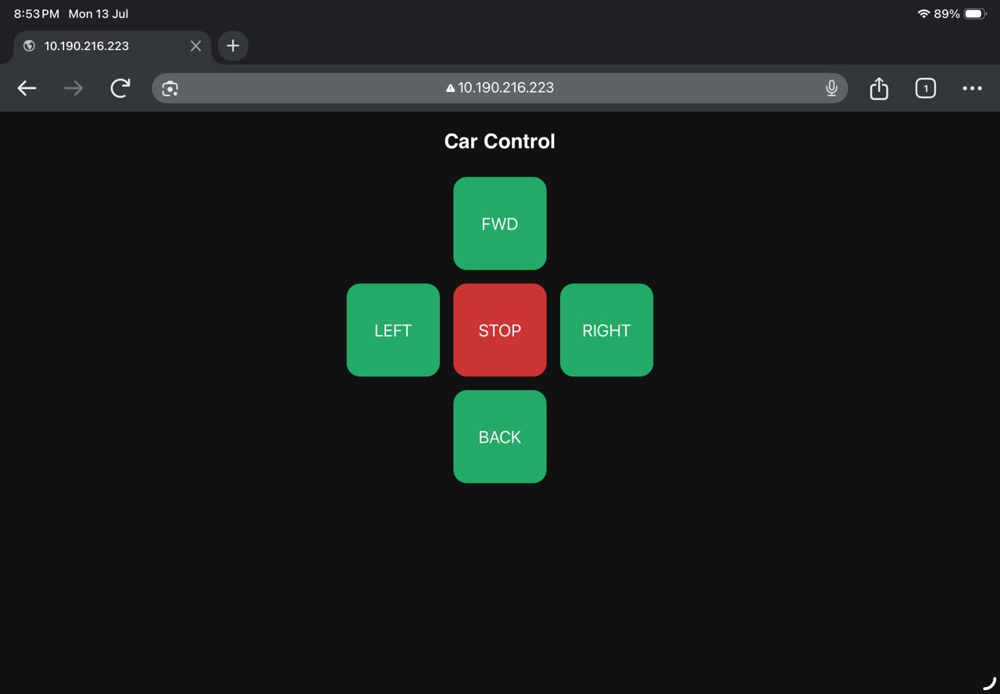
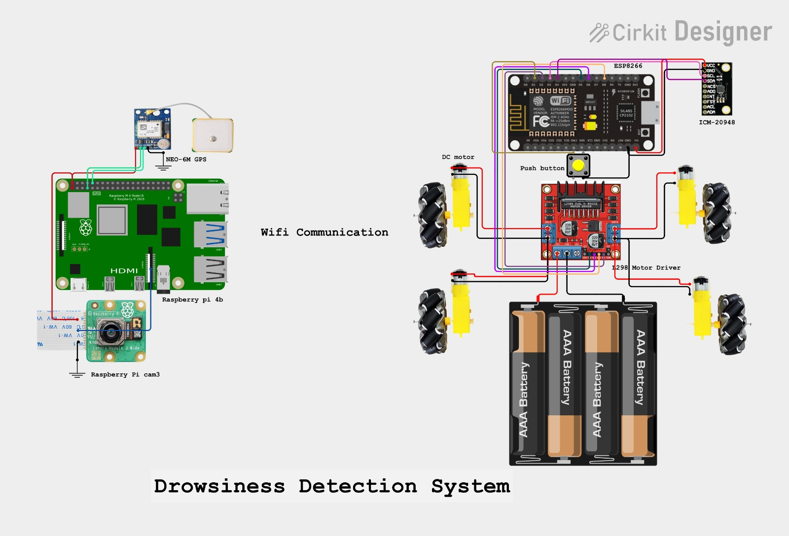
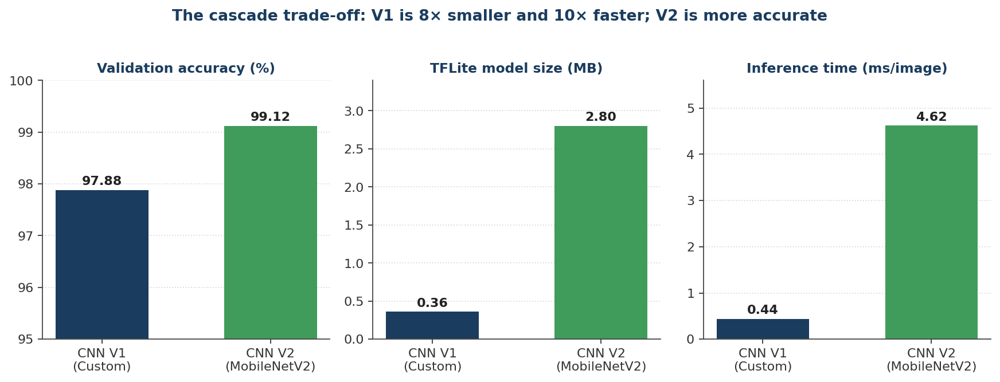
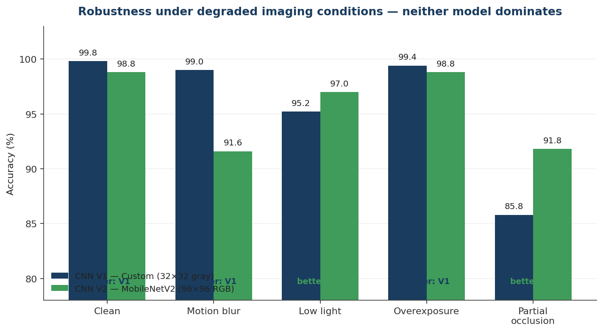
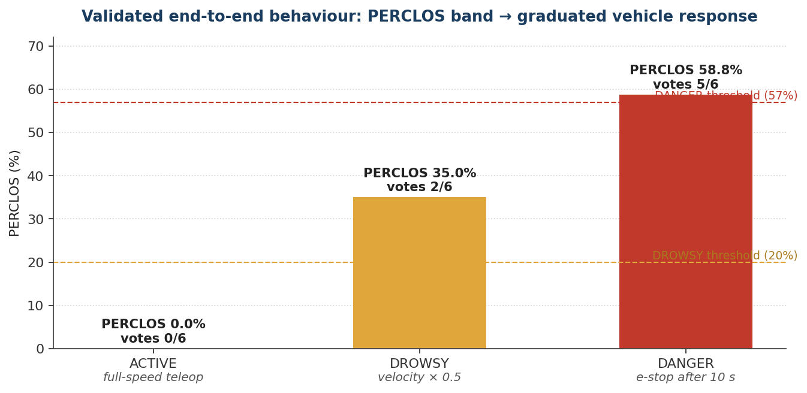

# Edge-Based Driver Monitoring System (DMS)

**A self-calibrating hybrid fatigue-detection pipeline with autonomous vehicle response — from Gazebo simulation to physical hardware.**

     

Real-time driver drowsiness detection running **entirely on a Raspberry Pi 4** — no cloud, no GPU. A hybrid **EAR + cascaded CNN** perception pipeline with an **unsupervised self-calibrating ensemble** classifies the driver as `ACTIVE`, `DROWSY`, or `DANGER`, and a **ROS2 decision layer** translates that state into graduated vehicle control: first validated on a **TurtleBot3 in Gazebo**, then deployed to a **physical prototype vehicle** (ESP8266 + L298N + ICM-20948 IMU).

- **99.12%** eye-state accuracy (MobileNetV2, TFLite) · **97.88%** (custom 0.36 MB CNN)
- **~30 FPS** sustained on the Pi 4 CPU · **< 500 MB** RAM · fully offline
- **10-second** automatic per-driver calibration — no fixed thresholds
- Same perception + decision code drives **both** the simulator and the real car

---

## Demo

| Perception running live on the Raspberry Pi 4 | |
|---|---|
|  |  |
| **DROWSY** — CNN cascade fired (`[CNN]` tag), PERCLOS 51.0%, all four ensemble models voting CLOSED → velocity halved | **DANGER** — EAR 0.08, PERCLOS 57.3% above the 57% threshold → emergency-stop countdown |


*Calibration complete → **ACTIVE** state (`R:OPEN, EAR 0.39`). The terminal shows the Flask API answering `GET /state` — this is the live feed the ROS2 bridge polls at 1 Hz.*

| Physical prototype vehicle | |
|---|---|
|  |  |
| ESP8266 (NodeMCU) + L298N motor driver + ICM-20948 IMU on a 4WD chassis | Top view — breadboard I2C bus, 4×AA motor supply, common-ground wiring |


*The ESP8266 joins Wi-Fi, prints its IP, and serves this Car Control page itself — any browser on the network can command the car, no app required.*

**Circuit design** (Cirkit Designer):



> The diagram shows the full concept including the NEO-6M GPS module. GPS was **removed from the final build** due to the ESP8266's exhausted GPIO/UART budget — the full engineering rationale is in [Hardware constraints](#gpio-constraints--why-gps-and-wheel-encoders-were-excluded).

---

## Project evolution: simulation → hardware

The project was built in two phases **on the same architecture**. Because perception, decision, and action are decoupled layers, moving from simulation to hardware required **zero changes** to the perception or decision code — only the action layer was swapped.

| | Phase 1 — Simulation | Phase 2 — Physical vehicle *(this repo)* |
|---|---|---|
| Perception | Raspberry Pi 4 (MediaPipe + CNNs + ensemble + Flask) | **unchanged** |
| Decision | ROS2 Jazzy bridge node on a Linux host | **unchanged** |
| Action | TurtleBot3 Burger in Gazebo (`/cmd_vel`) | ESP8266 + L298N + DC motors + ICM-20948 IMU |
| Extra sensing | — | 9-axis IMU as a camera-independent fatigue channel |

> **Phase 1 lives in its own repo:** [**Driver-drowsiness-detection-system**](https://github.com/2003one/Driver-drowsiness-detection-system) — the ROS2 Jazzy workspace (`dms_ws/`), the `dms_bridge_node`, and full instructions for running the DMS against a TurtleBot3 in Gazebo with SLAM Toolbox + Nav2. This repo contains Phase 2: the edge perception pipeline and the physical vehicle.

---

## System architecture

Three independent, individually replaceable layers:

```
┌─────────────────────────── PERCEPTION — Raspberry Pi 4 ───────────────────────────┐
│  Camera (USB / IP stream)                                                         │
│    └─ MediaPipe Face Mesh → 468 landmarks                                         │
│         ├─ EAR (geometric, per eye)          ┐                                    │
│         ├─ CNN cascade: V1 (every frame) ────┼─→ hybrid open/closed decision      │
│         │              V2 (only if ambiguous)┘                                    │
│         ├─ Unsupervised ensemble (KMeans · GMM · IsoForest · OC-SVM) → votes /6   │
│         └─ PERCLOS (rolling 30 s / 900-frame window) → fatigue %                  │
│    State machine → ACTIVE / DROWSY / DANGER → Flask REST API (:5000/state)        │
└────────────────────────────────────┬──────────────────────────────────────────────┘
                                     │  HTTP poll @ 1 Hz
┌────────────────────────────────────▼──────── DECISION — Linux host, ROS2 Jazzy ───┐
│  dms_bridge_node:                                                                 │
│    /cmd_vel_teleop (manual input) ──→ policy ──→ /cmd_vel                         │
│    ACTIVE: pass-through · DROWSY: linear vel × 0.5 · DANGER ≥ 10 s: zero-vel stop │
└────────────────────────────────────┬──────────────────────────────────────────────┘
                                     │
        ┌────────────────────────────┴────────────────────────────┐
        ▼ Phase 1                                                 ▼ Phase 2
┌──────────────────────┐                        ┌──────────────────────────────────┐
│ TurtleBot3 (Gazebo)  │                        │ ESP8266 → L298N → 4× DC motors   │
│ SLAM Toolbox + Nav2  │                        │ ICM-20948 IMU (I2C) → dynamics   │
└──────────────────────┘                        │ Web UI + push-button override    │
                                                └──────────────────────────────────┘
```

**Division of computation** follows a deliberate sense–think–act split: the **Pi senses** (all AI inference needs an application processor with hundreds of MB of RAM), the **laptop thinks** (ROS2 policy, SLAM, Nav2 live where tooling is plentiful), and the **ESP8266 acts** (toggling H-bridge pins and reading I2C needs deterministic microsecond GPIO work, not compute). Each task runs on the cheapest processor that can do it well.

---

## Repository structure

```
.
├── car/                        # ── Raspberry Pi ── perception + Flask API
│   ├── realtime.py             # main real-time loop (MediaPipe → EAR → CNNs → ensemble → PERCLOS → API)
│   └── requirements.txt
├── esp8266_firmware/           # ── Physical vehicle ── Arduino C++ firmware
│   └── car.ino                 # Wi-Fi web server, active-LOW motor control, IMU + bias calibration
├── training/                   # model training scripts
│   ├── train_v1_cnn.py         # custom CNN (32×32×1 grayscale)
│   └── train_v2_mobilenet.py   # MobileNetV2 transfer learning (96×96×3)
├── models/                     # TFLite weights (GitHub Releases / Git LFS — not committed)
├── docs/
│   ├── images/                 # screenshots, photos, circuit, charts
│   └── DMS_Pipeline_Flow.pdf   # frame-by-frame worked example with real numbers
└── README.md
```

> The ROS2 decision layer (`dms_ws/` workspace with `dms_bridge_node`) lives in the companion repo: [Driver-drowsiness-detection-system](https://github.com/2003one/Driver-drowsiness-detection-system). The Pi virtualenv (`mp_env/`) is not committed — regenerate it locally (see [Getting started](#getting-started)).

---

## Hardware

### Bill of materials

| Component | Layer | Role & why it was chosen |
|---|---|---|
| Raspberry Pi 4 (4 GB) | Perception | Runs the entire AI pipeline at ~30 FPS on CPU — cheap, private, offline-capable |
| USB webcam / IP camera | Perception | Non-contact in-cabin sensing; the driver wears nothing |
| Laptop (ROS2 Jazzy) | Decision | Hosts the bridge node, SLAM Toolbox, Nav2 — keeps heavy autonomy logic off the Pi |
| ESP8266 (NodeMCU) | Action | Built-in Wi-Fi, ultra-low cost, enough GPIO for motors + one I2C bus. Executes commands only — no AI — so a minimal MCU is the correct fit |
| L298N H-bridge (active-LOW) | Action | Converts 3.3 V logic to motor current; enables direction reversal |
| 4× DC gear motors + chassis | Action | Geared for torque at low PWM duty |
| ICM-20948 9-axis IMU | Action | Camera-independent fatigue channel from vehicle dynamics — 9 measurement axes for just 2 pins (I2C) |
| Push button (D3, `INPUT_PULLUP`) | Action | Physical start/stop override, independent of the software stack |
| 4× AA battery pack | Action | Separate motor supply; grounds tied to the ESP8266 (common ground is mandatory) |

### ESP8266 GPIO allocation

The ESP8266 defines 17 GPIOs on paper, but six are wired to SPI flash, two form the flashing/debug UART, three are boot-strap pins with hard electrical preconditions, and GPIO16 lacks interrupts/PWM/I2C. What's genuinely free is a handful of pins — and this budget shaped the entire sensor selection:

| NodeMCU | GPIO | Assigned to | Constraint notes |
|---|---|---|---|
| D1 | GPIO5 | I2C SCL — ICM-20948 | Default I2C clock |
| D2 | GPIO4 | I2C SDA — ICM-20948 | Default I2C data |
| D5 | GPIO14 | Motor IN1 | Free GPIO |
| D6 | GPIO12 | Motor IN2 | Free GPIO |
| D7 | GPIO13 | Motor IN3 | Free GPIO |
| D0 | GPIO16 | Motor IN4 | No interrupt/PWM/I2C — fine for a direction line |
| D3 | GPIO0 | Push button (pull-up) | Boot-strap pin; pull-up keeps it HIGH at reset |
| TX/RX | GPIO1/3 | UART0 — flash & debug | Repurposing = losing programmability |
| D4 | GPIO2 | — unassigned — | Boot-strap (HIGH at reset); shared with onboard LED |
| D8 | GPIO15 | — unassigned — | Boot-strap (must be LOW at reset) |

### GPIO constraints — why GPS and wheel encoders were excluded

**GPS (NEO-6M):** streams NMEA sentences over UART, but the only hardware UART is committed to flashing/debug. Software serial on D4 proved fragile — D4 is a boot-strap pin a peripheral can hold at the wrong level during reset, and bit-banged timing is disturbed by the Wi-Fi stack and concurrent I2C traffic, corrupting sentences exactly when the system is busiest. Since GPS provides *context* rather than core fatigue evidence, it was removed rather than shipped unreliable.

**Wheel speed sensor:** pulse counting needs interrupt-capable pins. After the motor/IMU/button allocation, only D0 (no interrupts at all) and D8 (a sensor holding it HIGH bricks the boot) remain. There is no electrically safe option. Longitudinal speed context is partially recoverable from the IMU's accelerometer X-axis instead.

Both exclusions are **prototype constraints, not architecture constraints** — an ESP32 restores both without touching any other layer (see [Roadmap](#roadmap--future-work)).

### The active-LOW lesson

The most instructive hardware bug: writing `LOW` to all four IN pins to stop the motors — and the motors kept running. Systematic isolation (flashing a sketch with all motor writes disabled; motors *still* ran) revealed the driver board uses **active-LOW inputs**: `LOW` = channel ON. The firmware inverts all control logic and `stopMotors()` writes every pin `HIGH`. Related requirement confirmed while debugging: the ESP8266 GND and motor-driver GND **must share a common ground** even with separate batteries, or the driver inputs float at undefined levels.

---

## How it works — the math, stage by stage

Every camera frame passes through six stages. A fully worked example with real numbers is in [`docs/DMS_Pipeline_Flow.pdf`](docs/DMS_Pipeline_Flow.pdf); this section summarises the mathematics of each stage.

### Stage 1 — MediaPipe Face Mesh: finding the eyes

MediaPipe Face Mesh places **468 anatomically consistent 3D landmarks** on the face per frame, in real time on the Pi's CPU. Six landmarks ring each eye:

```
Right eye: 33, 160, 158, 133, 153, 144
Left eye:  362, 385, 387, 263, 373, 380
```

They form a hexagon per eye — two horizontal corner points (P1, P4) and two vertical pairs (P2–P6, P3–P5):

```
        P2 ─── P3
       /         \
     P1           P4        ← eye corners (horizontal width)
       \         /
        P6 ─── P5
```

**Why it works:** landmark indices are stable across faces and frames — index 33 is *always* the right-eye corner — so downstream geometry never has to re-identify anatomy.

### Stage 2 — EAR: Eye Aspect Ratio (geometry, every frame)

One number per eye describing how open it is — the ratio of vertical opening to horizontal width (Soukupová & Čech, 2016):

$$EAR = \frac{\lVert P_2 - P_6 \rVert + \lVert P_3 - P_5 \rVert}{2\,\lVert P_1 - P_4 \rVert}$$

- Open eye → tall shape → **high EAR** (typically ≈ 0.25–0.35)
- Closing eye → vertical distances collapse → **EAR → 0**

Both eyes are computed separately and averaged: `EAR_avg = (EAR_L + EAR_R) / 2`.

**Worked example** (from the pipeline doc): right eye verticals |35−43| = 8 and 8, width |33−57| = 24 → `EAR_R = 16/48 = 0.167` (drooping). Left eye → `EAR_L = 20/48 = 0.417` (open). Average **0.292** against a calibrated baseline of 0.30.

EAR costs a few subtractions and one division — that's why it runs on **every** frame. But it varies per person and degrades under glasses or head pose, which is why:

### Stage 3 — Cascaded CNN eye-state classification (vision, on demand)

Two TFLite CNNs classify the cropped eye region:

| | **CNN V1 — custom** | **CNN V2 — MobileNetV2** |
|---|---|---|
| Input | 32×32×1 grayscale | 96×96×3 RGB |
| Parameters | 92,801 | 2,618,945 |
| TFLite size | **0.36 MB** | 2.80 MB |
| Inference | **0.44 ms** | 4.62 ms |
| Val. accuracy | 97.88% | **99.12%** |

**Cascade logic:** V1 runs on every frame. V2 is invoked **only** when V1 is ambiguous (`0.3 < p < 0.7`) or when the CNN and EAR estimates disagree. This gives ~30 FPS in the common case and V2-grade accuracy on hard frames (15–20 FPS when V2 fires frequently).

Trained on the Open–Closed Eyes dataset (174,756 images, augmented to ≈240,000), MobileNetV2 fine-tuned in two phases.

### Stage 4 — Self-calibrating unsupervised ensemble (is this abnormal *for this driver*?)

At startup the system spends **10 seconds (~300 frames)** in a `CALIBRATING` state learning the driver's personal baseline: mean EAR `μ` and standard deviation `σ`. Four unsupervised models are fitted to that baseline and vote on every subsequent frame — a **weighted score out of 6**:

| Model | Weight | The math behind its vote |
|---|---|---|
| MiniBatch K-Means | 1 | Two clusters learned from the baseline (open-centroid, closed-centroid). Votes anomalous if the current EAR is nearer the closed centroid: compare `\|EAR − c_open\|` vs `\|EAR − c_closed\|` |
| Gaussian Mixture Model | 1 | Soft probabilistic membership. z-score `z = (EAR − μ)/σ`; low likelihood under the "open" Gaussian → anomalous |
| Isolation Forest | **2** | Random trees isolate points; anomalies need few splits to isolate (short average path length), normal points sit in dense regions and need many |
| One-Class SVM | **2** | Learns a boundary around normal baseline behaviour; votes anomalous when the current EAR falls outside it |

**Worked example:** EAR 0.292 vs baseline μ=0.30, σ=0.03 → z = −0.27 (well within normal), nearest cluster = open, inside the SVM boundary → **0/6 votes**. One slightly-low frame triggers nothing — sustained closure is the job of:

### Stage 5 — PERCLOS: accumulating evidence over time

PERCLOS = **PER**centage of eye **CLOS**ure over a rolling window (Dinges & Grace, FHWA, 1998). At 30 FPS with a 30 s window (900 frames):

$$PERCLOS = \frac{\text{closed frames in window}}{900} \times 100\%$$

A normal blink (<100 ms ≈ 1–3 frames) contributes almost nothing over 900 frames — only **sustained or repeated closures** move PERCLOS. Example: 396 closed frames / 900 = **44.0%** → the DROWSY band.

### Stage 6 — Deterministic state machine → vehicle response

```
PERCLOS < 20%            → ACTIVE  → full-speed teleoperation
20% ≤ PERCLOS < 57%      → DROWSY  → linear velocity × 0.5
PERCLOS ≥ 57%            → DANGER  → autonomous emergency stop
                                     (only after 10 CONTINUOUS seconds)
```

The 10-second confirmation window suppresses false interventions from brief closures or glances away. The ensemble score corroborates the band (e.g. DROWSY can also trigger on multiple anomaly indicators).

**Why six stages?** No single measurement is trustworthy alone. EAR is fooled by sunglasses; CNNs by extreme lighting; instantaneous anomalies would fire false alarms. Each component's failure mode is covered by another — that's how noisy sensors become a decision you can act on.

### The IMU channel — fatigue evidence the camera can't see

A camera-only DMS has a structural blind spot: it can only watch the face. Sunglasses, backlight, night cabins, and vibration all degrade the visual channel — and the robustness results below confirm **partial occlusion is the hardest condition for both CNNs**. Fatigue, however, also shows in *how the vehicle is driven*: slow lane weaving with abrupt corrections, growing lateral sway, noisy speed-keeping.

The **ICM-20948** on the physical car observes exactly those signatures:
- **Gyro Z (yaw rate):** the weave-and-correct steering oscillation of a drowsy driver appears as low-frequency angular-velocity oscillation
- **Accel X/Y:** longitudinal jerk and lateral sway from late, irregular corrections
- **200-sample gyro bias calibration at every boot** — gyro bias (unlike zero-mean noise) accumulates linearly under integration and must be subtracted first (measured on this unit: ≈ +0.75 °/s X, −0.43 °/s Z)
- The **magnetometer is deliberately unused**: absolute heading adds nothing to relative-dynamics fatigue detection, and the adjacent motor wiring would corrupt it anyway

The two channels are **complementary, not redundant**: the camera detects fatigue *before* it affects driving; the IMU detects it *once it does* — and keeps working precisely where the camera is weakest.

---

## Results

### Model performance & the cascade trade-off



### Robustness under degraded conditions — why *both* CNNs are needed

| Condition | CNN V1 | CNN V2 | Better model |
|---|---|---|---|
| Clean images | **99.8%** | 98.8% | V1 (+1.0) |
| Motion blur | **99.0%** | 91.6% | V1 (+7.4) |
| Low light | 95.2% | **97.0%** | V2 (+1.8) |
| Overexposure | **99.4%** | 98.8% | V1 (+0.6) |
| Partial occlusion | 85.8% | **91.8%** | V2 (+6.0) |



Neither model dominates: V1's coarse grayscale input shrugs off blur and exposure extremes; V2's pretrained features handle low light and occlusion (under occlusion V2 cut false eye-closure detections from 61 → 41 of 250 open-eye samples, ≈33% fewer of the exact error mode that causes unnecessary interventions). This complementarity **is** the empirical case for the cascade — and occlusion, the camera's weakest condition, is where the IMU channel earns its place.

### End-to-end validated behaviour

| Driver state | PERCLOS | Ensemble score | Observed vehicle response |
|---|---|---|---|
| ACTIVE | 0.0% | 0/6 | Full-speed teleoperation |
| DROWSY | 35.0% | 2/6 | Velocity reduced to 50% |
| DANGER | 58.8% | 5/6 | Autonomous emergency stop after 10 s |



Sustained throughout: **~30 FPS**, **< 500 MB** RAM, **zero network dependency** on the Pi.

---

## Getting started

### Prerequisites

**Raspberry Pi 4** — 5V/3A supply, camera, **Python 3.11** (MediaPipe publishes no wheel for the Python 3.13 that ships with current Pi OS — build 3.11 in a venv).

**Linux host (Phase 1 simulation / ROS2 decision layer)** — see the companion repo below; requires Ubuntu 24.04, ROS2 **Jazzy**, Gazebo, and the TurtleBot3 packages.

**Physical car (optional)** — Arduino IDE with ESP8266 board support (`http://arduino.esp8266.com/stable/package_esp8266com_index.json` in Board Manager URLs).

### 1 · Raspberry Pi — perception (`car/`)

```bash
cd ~/car
python3.11 -m venv mp_env
source mp_env/bin/activate
pip install -r requirements.txt

# run (software GL — no GPU path needed on the Pi)
LIBGL_ALWAYS_SOFTWARE=1 python3 realtime.py
```

On start, the system enters `CALIBRATING` for ~10 s — **look at the camera with eyes naturally open**. It then serves the live dashboard and the state API at `http://<pi-ip>:5000/state`:

```json
{"state": "DROWSY", "perclos": 35.0, "votes": 2, "ear": 0.21}
```

### 2 · Decision layer + simulation (Phase 1 — companion repo)

The ROS2 workspace, the `dms_bridge_node`, and the full Gazebo/TurtleBot3 walkthrough live in:

**➜ [2003one/Driver-drowsiness-detection-system](https://github.com/2003one/Driver-drowsiness-detection-system)**

In short: the bridge polls this repo's Flask API at 1 Hz, subscribes to a **remapped** teleop topic (`/cmd_vel_teleop`), applies the driver-state policy (pass-through / ×0.5 / zero-velocity), and republishes on `/cmd_vel` — the DMS *gates* manual control instead of fighting it. In DANGER (10 s sustained) it publishes zero-velocity at 10 Hz, overriding input entirely. Follow that repo's README for `colcon build` and the three-terminal launch sequence.

### 3 · Run the physical car (Phase 2)

1. **Flash** `esp8266_firmware/car.ino` with your Wi-Fi credentials (Arduino IDE → NodeMCU 1.0).
2. **Power up** — open the Serial Monitor (115200): the ESP8266 joins Wi-Fi, runs the **200-sample gyro bias calibration** (keep the car still), and prints its IP.
3. **Open the IP in any browser** on the same network → the Car Control page (FWD / LEFT / STOP / RIGHT / BACK) is served directly from the microcontroller.
4. The **push button (D3)** is a physical start/stop override, independent of software.
5. Point the ROS2 bridge / decision layer at the car's endpoint instead of the simulator — no other layer changes.

**Wiring must-knows:** the L298N board used here is **active-LOW** (LOW = channel ON — firmware inverts all logic); ESP8266 GND and motor-driver GND **must be tied together** even with separate batteries; the ICM-20948 sits on I2C at **address 0x69** (AD0 pulled high).

### 4 · Training (optional, `training/`)

```bash
cd training
python train_v1_cnn.py          # custom CNN, 32×32 grayscale
python train_v2_mobilenet.py    # MobileNetV2 two-phase fine-tuning, 96×96 RGB
```

Weights are distributed via GitHub Releases / Git LFS; the dataset (Open–Closed Eyes, Kaggle) is linked in `training/README.md`, not stored in the repo.

---

## Positioning: what this adds in edge-AI driver monitoring

Most published DMS work stops at one of three points: a fatigue **classifier** evaluated offline, a **detection demo** on a desktop GPU, or a cloud-connected pipeline. This project differs on four axes:

1. **Fully edge-native, closed-loop.** The complete sense→decide→act loop runs on commodity hardware (Pi 4 + ESP8266) with no cloud and no GPU — video never leaves the device (privacy by architecture), and the system works with zero network coverage.
2. **Self-calibrating, driver-independent.** Fixed EAR thresholds are a known weakness of the literature; here a 10-second unsupervised calibration (4-model ensemble) adapts to each driver's eye geometry automatically.
3. **Complementary redundancy by design, verified empirically.** The cascade isn't a speed hack — the robustness study shows V1 and V2 fail in *different* conditions, and the IMU covers the camera's worst case (occlusion). Every component's failure mode is covered by another.
4. **Simulation-to-hardware portability demonstrated.** The same perception and decision code drove Gazebo and the physical vehicle — evidence the layered architecture is real, not diagrammatic.

*(A research write-up expanding on these points is in progress.)*

---

## Design trade-offs & known limitations

- **Throughput vs. robustness:** 15–20 FPS when V2 fires frequently (vs ~30 FPS V1-only) — accepted for accuracy on hard frames.
- **ESP8266 pin budget** forced the removal of GPS and precluded wheel encoders (details [above](#gpio-constraints--why-gps-and-wheel-encoders-were-excluded)).
- Training data is cropped eye images, not continuous in-vehicle footage; robustness was tested with controlled transformations, not combined real-world stressors.
- Eye state is the sole visual cue — yawning (Mouth Aspect Ratio) is not yet exploited.
- Single-developer project; thresholds tuned on limited data.

## Roadmap / future work

**Hardware**
- **ESP8266 → ESP32:** ~3 dozen GPIOs, 3 hardware UARTs, dual I2C, dedicated pulse counters — restores the **GPS module** and enables **wheel encoders** with zero changes to other layers.
- **Continuous IMU-based vehicle control (6-DoF):** today the IMU is an evidence channel and the response is stepped (100% → 50% → stop). The next step is streaming **pitch/roll/yaw + 3-axis acceleration** through a complementary/Kalman filter and using it as a *continuous* control signal — progressively and smoothly reducing speed as vehicle-dynamics instability grows, instead of stopping abruptly. Graceful degradation, not a brake slam.
- HC-SR04 ultrasonic ranging for obstacle-aware emergency stops.

**Perception**
- **Fuse IMU features (yaw-rate oscillation, lateral acceleration) into the unsupervised ensemble** as first-class fatigue evidence — a 6-model ensemble spanning two physical modalities.
- **Better-trained ensemble:** longer calibration options, drift handling over long sessions, per-model threshold learning.
- Mouth Aspect Ratio (MAR) for yawn detection; retraining on driving-specific datasets; multi-driver field trials to validate calibration stability.

**Engineering**
- Port perception to a C++ ROS2 node for production deployment.

---

## References (key)

- Soukupová & Čech, *Real-Time Eye Blink Detection using Facial Landmarks*, CVWW 2016 — **EAR**
- Dinges & Grace, *PERCLOS: A Valid Psychophysiological Measure of Alertness*, FHWA-MCRT-98-006, 1998 — **PERCLOS**
- Sandler et al., *MobileNetV2: Inverted Residuals and Linear Bottlenecks*, CVPR 2018
- Lugaresi et al., *MediaPipe: A Framework for Building Perception Pipelines*, arXiv:1906.08172
- Macenski et al., *Robot Operating System 2*, Science Robotics 2022
- WHO, *Global Status Report on Road Safety 2023*; AAA Foundation, *Drowsy Driving in Fatal Crashes 2017–2021*, 2024

Full reference list: see [`docs/DMS_Project_Report.pdf`](docs/).

---

## Author

**Abhishek Chauhan** — MSc Computer Science (Future Mobility & Cyber-Physical Systems), Hochschule für angewandtes Management, Munich
GitHub: [@2003one](https://github.com/2003one) · abhishekc.dev@gmail.com

## License

MIT — see [LICENSE](LICENSE).
